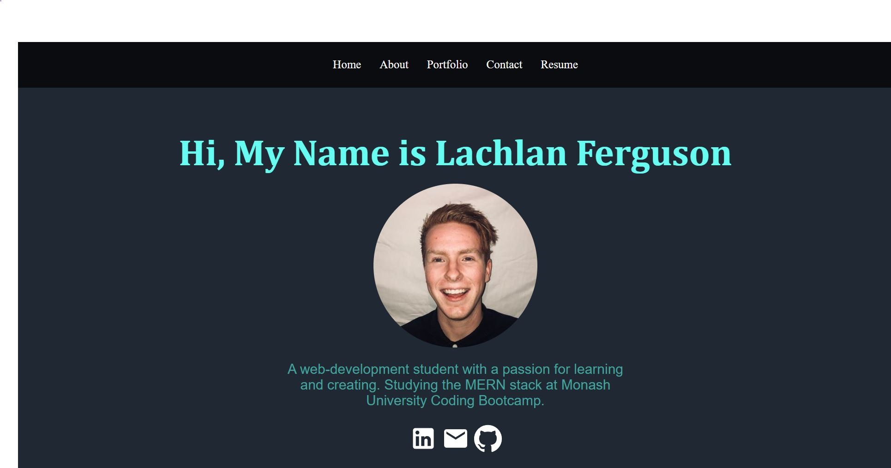

# React Portfolio

## Table of Contents 
- [Project Description](#description)
- [Installation](#installation)
- [License](#license)
- [Installation](#installation)
- [Questions](#questions)

## Description
A React portfolio page featuring my projects during the Monash University Coding Boot-camp. The portfolio also has a link to download my current resume.

[Link to deployed application]()

## Installation 
Dependencies required are : 
- react
- react-dom
- react-router-dom
- react-scripts
- web-vitals

Run the application by using `yarn start`

## License 
MIT 

## Questions 
- Github: (https://github.com/Lferg98)
- Personal Email: lachieferg98@hotmail.com
